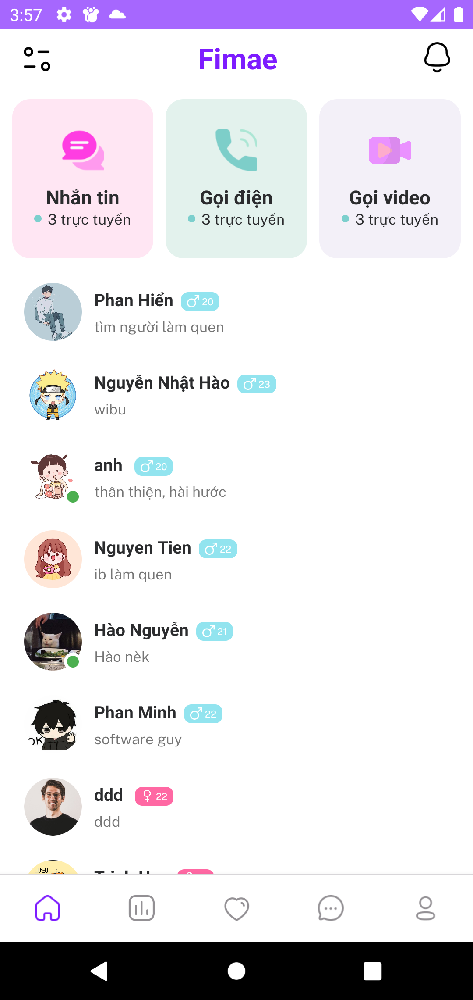
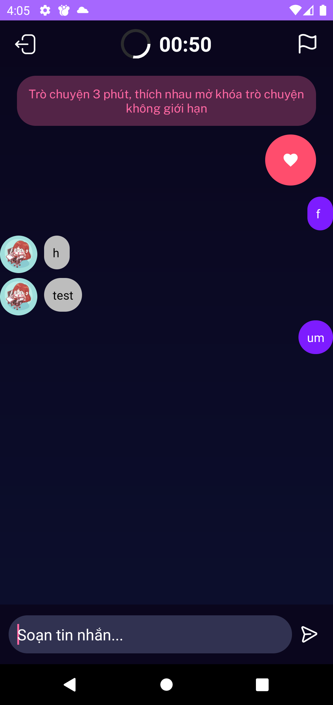
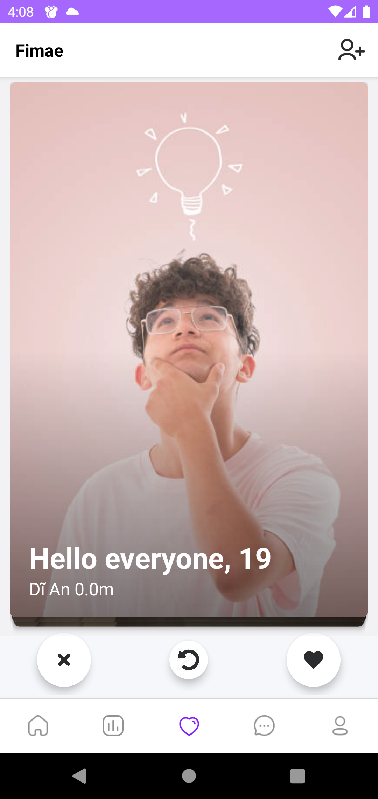

# Fimae - Random Social Media App

<p align="center">
  
</p>
Fimae is a social networking application developed in Android Java that allows users to connect randomly with strangers, enabling them to exchange messages, make voice calls, and have video calls with each other. This app aims to bring people together in a unique and exciting way, fostering new connections and friendships.

## Features

- **Random Matching**: Users can connect with random strangers and start conversations with them.
- **Messaging**: Users can send and receive text messages with their matched strangers.
- **Voice Calls**: Fimae allows users to make voice calls with their matched strangers.
- **Video Calls**: Users can have video calls with the strangers they are connected to.
- **User Profiles**: Users can create profiles with information about themselves.
- **Notification**: Users will receive notifications about new messages and calls.
- **Privacy**: Users can report or block inappropriate users.
- **Tinder-Like Dating**: Users can view profiles of other users and either like or dislike them anonymously. If two users like each other, they will be matched and can start messaging or calling.
- **Posts**: Users can create and share posts with text, images, allowing them to express their thoughts, feelings, and experiences with the community.
- **Shorts (TikTok-like)**: Similar to TikTok or Instagram's "Reels," Shorts allow users to create short-form videos, typically ranging from a few seconds to a minute, and share them with their followers or the wider community.
- **Stories**: Users can create stories with a series of images or videos that stay visible for 24 hours, giving their followers a glimpse into their lives and activities.

## Screenshots

<p align="center">
  
  
  
  
</p>

## Getting Started

Follow these instructions to get a copy of the project up and running on your local machine for development and testing purposes.

### Prerequisites

- Android Studio installed on your computer.
- An Android device or emulator to run the app.

### Installing

1. Clone the repository to your local machine using Git or download the zip file.

```git clone https://github.com/minhphan46/Fimae.git```

2. Open Android Studio and select "Open an existing Android Studio project."
3. Navigate to the directory where you cloned or downloaded the project and click "OK."
4. Wait for Android Studio to finish setting up the project.

### Running the App

1. Connect your Android device to your computer or start an Android emulator.
2. Click on the "Run" button in Android Studio, or press Shift+F10, to build and launch the app on your device or emulator.


## Contributing

We welcome contributions to Fimae! If you find any bugs or have suggestions for improvements, feel free to open an issue or submit a pull request. 

## Authors

| No. | Name            | Student ID |
|----:|-----------------|------------|
|   1 | Nguyễn Nhật Hào | 21522046   |
|   2 | Phan Văn Minh   | 21522345   |
|   3 | Lê Phan Hiển    | 21520839   |
|   4 | Nguyễn Tiến Anh | 21520579   |


---
